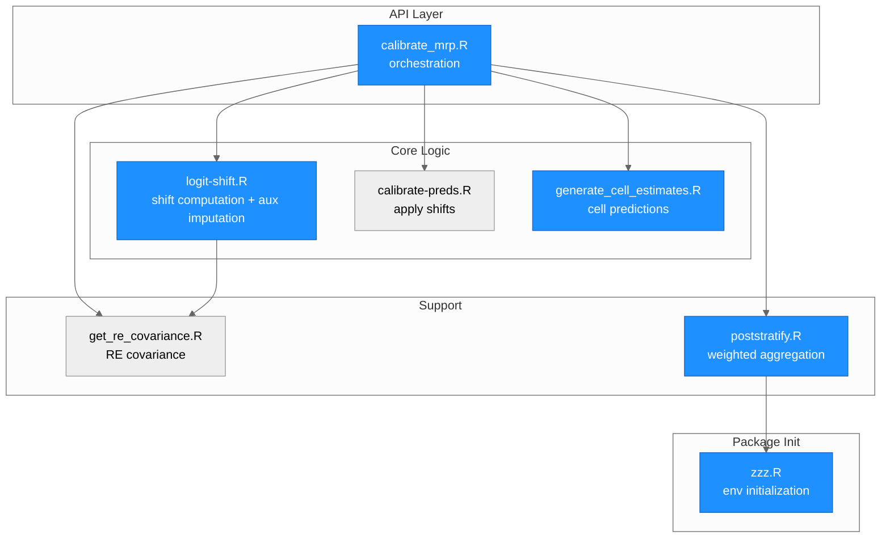
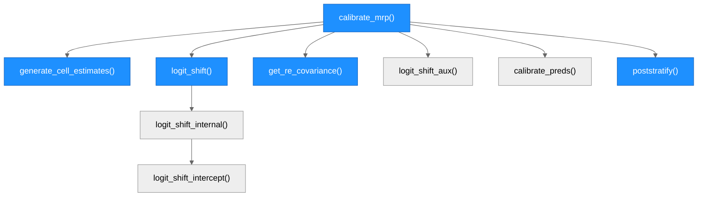
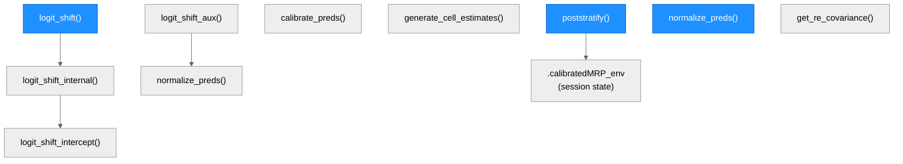
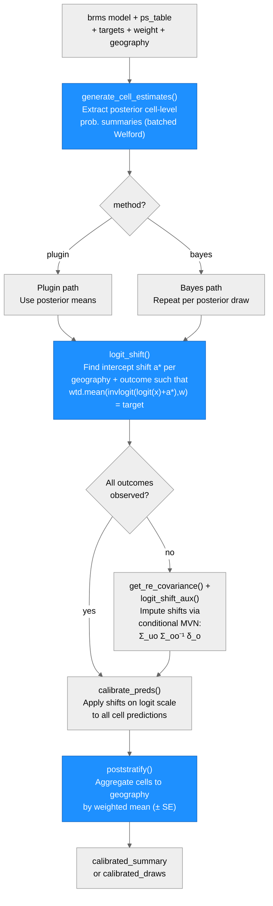

# Architecture — calibratedMRP

> Generated by scriber for run `2026-04-27-code-review-fixes` on 2026-04-27.

## Overview

`calibratedMRP` is an R package implementing calibrated multilevel regression and poststratification (MRP) from Marble & Clinton (2025). The method extends standard MRP by calibrating model-based cell-level predictions to known population quantities (e.g., election results), then propagating that calibration to outcomes without ground truth via the covariance structure of geographic random effects in a fitted `brms` model. The package exposes both a high-level orchestration function (`calibrate_mrp()`) and lower-level building blocks that can be used standalone.

Key external dependencies: `brms` (model fitting), `dplyr` / `tidyselect` / `rlang` (tidy data manipulation and NSE), `furrr` / `purrr` (parallelization), `tidybayes` (posterior draw extraction), `MASS` (multivariate normal sampling), `posterior`.

---

## Module Structure



Blue fill = files modified in Run 1 (2026-04-27-code-review-fixes).

### Module Reference

| File | Layer | Purpose | Key Exports | Changed (Run 1) |
| --- | --- | --- | --- | --- |
| `R/calibrate_mrp.R` | API | Top-level orchestration; routes to all pipeline stages | `calibrate_mrp()` | yes |
| `R/logit-shift.R` | Core | Logit shift computation; auxiliary imputation via conditional MVN; `normalize_preds()` | `logit_shift()`, `logit_shift_aux()`, `normalize_preds()` | yes |
| `R/calibrate-preds.R` | Core | Apply pre-computed shifts to cell predictions on logit scale | `calibrate_preds()` | no |
| `R/generate_cell_estimates.R` | Core | Extract batched posterior summaries from `brms` model using Welford's online algorithm | `generate_cell_estimates()` | yes |
| `R/get_re_covariance.R` | Support | Extract geographic random effect covariance from `brms` posterior | `get_re_covariance()` | yes |
| `R/poststratify.R` | Support | Weighted aggregation from cell level to geography level; SE propagation | `poststratify()` | yes |
| `R/zzz.R` | Init | Package-level environment (`.calibratedMRP_env`); initialized at namespace load | — | yes (new file) |

---

## Function Call Graph

### Main Pipeline



### Standalone Entry Points

All of the following are exported and can be called independently of `calibrate_mrp()`:



### Function Reference

| Function | Defined In | Exported | Called By | Purpose | Changed (Run 1) |
| --- | --- | --- | --- | --- | --- |
| `calibrate_mrp()` | `calibrate_mrp.R` | yes | user | Top-level pipeline orchestrator | yes |
| `generate_cell_estimates()` | `generate_cell_estimates.R` | yes | `calibrate_mrp`, user | Extract posterior cell summaries (batched Welford) | yes |
| `logit_shift()` | `logit-shift.R` | yes | `calibrate_mrp`, user | Find logit shifts matching calibration targets | yes |
| `logit_shift_aux()` | `logit-shift.R` | yes | `calibrate_mrp`, user | Impute shifts for unobserved outcomes via conditional MVN | no |
| `logit_shift_internal()` | `logit-shift.R` | no | `logit_shift` | Per-geography per-outcome shift computation | no |
| `logit_shift_single()` | `logit-shift.R` | no | `logit_shift_internal` | Single-cell logit shift via `stats::optimize()` | no |
| `logit_shift_intercept()` | `logit-shift.R` | no | `logit_shift_single` | Scalar objective: weighted mean of inv-logit shifted probs | no |
| `calibrate_preds()` | `calibrate-preds.R` | yes | `calibrate_mrp`, user | Apply shifts on logit scale to cell predictions | no |
| `normalize_preds()` | `logit-shift.R` | yes | `logit_shift_aux`, user | Rescale predictions to satisfy sum constraints | yes |
| `get_re_covariance()` | `get_re_covariance.R` | yes | `calibrate_mrp`, user | Extract RE covariance matrix from brms posterior | yes |
| `poststratify()` | `poststratify.R` | yes | `calibrate_mrp`, user | Weighted aggregation to geography level with optional SE | yes |

---

## Data Flow



---

## Architectural Patterns

- **Tidy evaluation (NSE)**: User-facing functions accept bare column names (`geography = county`, `weight = est_n`). Arguments are captured via `rlang::enquo()` and the resulting quosure is passed to `tidyselect::eval_select()` for column resolution. The `outcomes` argument in `logit_shift()` supports the full range of tidyselect helpers (`c(a, b)`, `starts_with("voteshare")`, `any_of(...)`, etc.) — the quosure is captured before any NULL check so that helpers are never forced outside a selection context.

- **Batched Welford accumulation**: `generate_cell_estimates()` processes posterior draws in configurable batches (default 50) using Welford's online algorithm for numerically stable mean and variance accumulation, avoiding the memory cost of materializing all draws at once.

- **Conditional MVN imputation**: When some outcomes lack calibration targets, `logit_shift_aux()` imputes their shifts via the conditional expectation formula for the multivariate normal: the shift for unobserved outcomes is `Σ_uo Σ_oo⁻¹ δ_o`, where `Σ` comes from the posterior covariance of geographic random effects extracted by `get_re_covariance()`.

- **Plugin vs. full Bayes**: `calibrate_mrp()` supports two modes. Plugin uses posterior means and is fast (point estimates correlate >0.99 with full Bayes). Full Bayes repeats the calibration for each posterior draw and returns a `calibrated_draws` object; researchers summarize across `.draw` for uncertainty intervals.

- **Package-level mutable state**: `.calibratedMRP_env` (defined in `R/zzz.R`, initialized at namespace load) holds session flags, currently the `poststratify_se_warned` flag that suppresses repeated SE deprecation warnings within a session.

- **Base pipe exclusively**: All internal pipe usage in `R/` uses `|>` (R >= 4.1). No magrittr `%>%` dependency.

---

## Documented Validation (Run 1)

The `outcomes` argument to `logit_shift()` accepts both explicit bare-name lists and tidyselect helpers:

```r
# Bare names
logit_shift(ps, targets, outcomes = c(voteshare, turnout), ...)

# Tidyselect helpers — also supported
logit_shift(ps, targets, outcomes = starts_with("voteshare"), ...)
logit_shift(ps, targets, outcomes = any_of(c("voteshare", "turnout")), ...)
```

This works because the `outcomes` quosure is captured via `rlang::enquo()` before any NULL check, and the quosure is passed directly to `tidyselect::eval_select()` which provides the required selection context. Run 1 added TC-16 (tidyselect happy-path regression guard) to the test suite to protect this behavior.

---

## Class System

`calibrate_mrp()` returns a list with one of two classes:

| Class | When | Contents |
| --- | --- | --- |
| `calibrated_summary` | `method = "plugin"` or `method = "bayes"` with `posterior_summary = TRUE` | Poststratified estimates, geography-level shifts |
| `calibrated_draws` | `method = "bayes"` with `posterior_summary = FALSE` | Full per-draw cell-level predictions with `.draw` column |

No S3 methods are currently registered for these classes. Downstream analysis requires manual summarization (e.g., `group_by(geography) |> summarise(mean(estimate))`).

---

## Notes

- The `brms` dependency is central: the model's correlated geographic random effects supply the covariance structure used by `logit_shift_aux()`. The package will not function without a multivariate `brmsfit` with random intercepts for `geography`.
- `get_re_covariance.R:37` still uses `!"brmsfit" %in% class(model)` (a slightly different idiom from the `!inherits()` fix applied to `calibrate_mrp.R` in Run 1). This is noted as a deferred cleanup item for a future run.
- Integration tests in `tests/testthat/test-calibrate_mrp.R` are currently skipped because the brms fixture is incompatible with the current brms version. Fixture regeneration is a separate task.
- The `calibrate_mrp()` function accepts `weight` and `geography` as **strings** (not bare names), unlike `poststratify()` and `logit_shift()` which use tidy evaluation. This asymmetry is a known design inconsistency.
