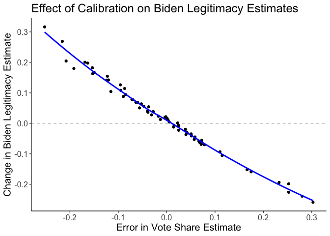

calibratedMRP: Improved small-area estimation with MRP
================

The `calibratedMRP` package implements tools for small-area estimation
using multilevel regression and poststratification (MRP) with
calibration to known population-level margins. The package features
user-friendly functions for performing the calibration and
poststratification steps, and is designed to work with models estimated
using the `brms` package.

The top-level functions is `calibrate_mrp()`, which takes as its input a
fitted `brms` model, a poststratification table, and known
population-level margins for one or more outcomes. It returns the
poststratification table with the calibrated estimates appended, along
with other information about the calibration procedure. The
`poststratify()` function can then be used to poststratify the
calibrated estimates to whatever level is of interest.

This package implements methods from [Marble and Clinton,
2025](https://osf.io/preprints/socarxiv/u3ekq_v1).

# Installation

You can install the latest version of `calibratedMRP` by running:

``` r
devtools::install_github("wpmarble/calibratedMRP")
```

# Quick-Start Guide

This short tutorial walks through an example of the package’s
functionality. We will use data from an opt-in survey conducted in 2022
to estimate the share of people who believe that Joe Biden was
legitimately elected in 2020. The survey asked three questions that we
will include in analysis:

- `biden_legitimate`: Binary variable indicating belief that Joe Biden
  is the legitimate president.
- `biden_appr`: Binary variable indicating approval of Joe Biden’s job
  performance.
- `presvote2020_twoparty`: Two-party vote choice in the 2020
  presidential election, coded as a binary variable for Biden (1)
  vs. Trump (0).

We will generate estimates of these outcomes at the county level in
Pennsylvania. We have access to ground-truth county-level data for the
2020 election, but not for the other two outcomes. We will use the
`calibratedMRP` package to ensure that our estimates of
`presvote2020_twoparty` match the known county-level results, and that
our estimates of `biden_legitimate` and `biden_appr` are adjusted
according to their correlation with `presvote2020_twoparty`.

## Step 0: Load data

We load three datasets:

- `surv`, a data frame with survey responses.
- `ps_cty`, a county-level poststratification table derived from the
  2022 American Community Survey. It includes an estimate of the number
  of people falling into each population cells defined by age $\times$
  race $\times$ gender $\times$ education $\times$ county.
- `targets` a dataset with county-level election results from 2020.

The data sets are pre-cleaned to ensure that all variable names and
levels match across datasets.

``` r
library(calibratedMRP)
library(brms)
library(dplyr)
library(ggplot2)
load("vignette-data.rdata")
```

## Step 1: Estimate outcome model using `brms`

First, we specify a multivariate outcome model using the `brms` package.
Here, we model binary outcomes as a function of demographic variables,
geographic variables, and random effects for geography. We make use of
two features of the `brms` modeling syntax. First, the `mvbind()`
function specifies a multivariate response vector. Second, the random
effects syntax `(1 | name | grouping_variable)` specifies random
intercepts for each level of `grouping_variable`, and these intercepts
are allowed to be correlated across outcomes. This step is extremely
important, as the estimated covariance matrix is used in downstream
calibration — allowing us to adjust estimates for outcomes where there
is no ground-truth data.

``` r
# Define formula
formula <- bf(
  mvbind(biden_legitimate, biden_appr, presvote2020_twoparty) ~

    # individual-level predictors
    gender + as.integer(agegrp) + (1 | age | agegrp) + race + educ +

    # state-level predictors
    st_demvs_2016_z + (1 | censreg | census.region) + (1 | state | state) +

    # county-level predictors
    cty_pct_nonwhite_z +  cty_pct_hispanic_z +
    cty_pct_college_z + cty_med_inc_z + cty_dem2020_z +
    (1 | c | countyfips)
)

# Estimate model
priors <- prior(normal(0, 5), class = b)
mod <- brm(formula = formula,
           data = surv,
           family = bernoulli,
           prior = priors,
           chains = 4, 
           cores = 4,
           iter = 1000,
           backend = "cmdstanr",
           adapt_delta = .995,
           max_treedepth = 12)
```

## Step 2: Calibrate MRP estimates

Next, the `calibrate_mrp()` function generates estimates of outcomes,
ensuring that the estimates match known population-level margins stored
in `targets`. Outcomes with known margins will be calibrated to match
exactly. Other outcomes will be adjusted according to their correlation
with the outcomes with gorund-truth data. Here, we will calibrate to
known county-level margins for `presvote2020_twoparty`, and estimates
for `biden_legitimate` and `biden_appr` will be adjusted accordingly.
For illustration, we’ll just include data from Pennsylvania and only
perform the calibration for a subset of the posterior draws.

``` r
calib_res <- calibrate_mrp(model = mod, 
                           ps_table = ps_cty %>% filter(state == "PA"), 
                           weight = "est_n", 
                           targets = targets, 
                           geography = "countyfips", 
                           method = "bayes",
                           draw_ids = sample(1:brms::ndraws(mod), 200))
#> Loading required package: rstan
#> Warning: package 'rstan' was built under R version 4.4.3
#> Loading required package: StanHeaders
#> Warning: package 'StanHeaders' was built under R version 4.4.3
#> 
#> rstan version 2.36.0.9000 (Stan version 2.36.0)
#> For execution on a local, multicore CPU with excess RAM we recommend calling
#> options(mc.cores = parallel::detectCores()).
#> To avoid recompilation of unchanged Stan programs, we recommend calling
#> rstan_options(auto_write = TRUE)
#> For within-chain threading using `reduce_sum()` or `map_rect()` Stan functions,
#> change `threads_per_chain` option:
#> rstan_options(threads_per_chain = 1)
#> No `outcomes` provided, defaulting to outcome variables from the model formula: 
#> • bidenlegitimate, bidenappr, presvote2020twoparty
#> Using the following variables for calibration: 
#> • presvote2020twoparty
#> Generating estimates for the following outcomes: 
#> • bidenlegitimate, bidenappr, presvote2020twoparty
```

## Step 3: Poststratify

Finally, we can poststratify to whatever level is of interest, using the
`poststratify()` function. Here we’ll poststratify to the county level.
Because we are working in a Bayesian framework, we will poststratify
once for each draw from the posterior, using `purrr::map()`, then
average these results together to obtain our posterior mean estimates.

``` r
out_draws <- calib_res$results %>% 
  group_split(.draw) %>% 
  purrr::map(~ poststratify(.x, outcomes = c(starts_with("biden"), starts_with("presvote")),
                            weight = est_n, by = countyfips)) %>% 
  bind_rows(.id = ".draw") 

out <- out_draws %>% 
  summarise(across(c(starts_with("biden"), starts_with("presvote")),
                   list(mean = mean,
                        q5 = ~ quantile(.x, .05),
                        q95 = ~ quantile(.x, .95))),
            .by = countyfips)
head(out, 20)
#> # A tibble: 20 × 19
#>    countyfips bidenlegitimate_mean bidenlegitimate_q5 bidenlegitimate_q95
#>    <chr>                     <dbl>              <dbl>               <dbl>
#>  1 42001                     0.589             0.411                0.741
#>  2 42003                     0.696             0.643                0.746
#>  3 42005                     0.375             0.0958               0.755
#>  4 42007                     0.772             0.669                0.881
#>  5 42009                     0.233             0.0793               0.458
#>  6 42011                     0.606             0.516                0.701
#>  7 42013                     0.309             0.185                0.450
#>  8 42015                     0.392             0.185                0.578
#>  9 42017                     0.698             0.624                0.778
#> 10 42019                     0.504             0.404                0.625
#> 11 42021                     0.266             0.122                0.424
#> 12 42023                     0.358             0.0850               0.704
#> 13 42025                     0.505             0.358                0.647
#> 14 42027                     0.524             0.430                0.613
#> 15 42029                     0.751             0.698                0.804
#> 16 42031                     0.188             0.0622               0.357
#> 17 42033                     0.316             0.157                0.491
#> 18 42035                     0.209             0.0535               0.411
#> 19 42037                     0.363             0.167                0.565
#> 20 42039                     0.370             0.137                0.595
#> # ℹ 15 more variables: bidenappr_mean <dbl>, bidenappr_q5 <dbl>,
#> #   bidenappr_q95 <dbl>, bidenlegitimate_calib_mean <dbl>,
#> #   bidenlegitimate_calib_q5 <dbl>, bidenlegitimate_calib_q95 <dbl>,
#> #   bidenappr_calib_mean <dbl>, bidenappr_calib_q5 <dbl>,
#> #   bidenappr_calib_q95 <dbl>, presvote2020twoparty_mean <dbl>,
#> #   presvote2020twoparty_q5 <dbl>, presvote2020twoparty_q95 <dbl>,
#> #   presvote2020twoparty_calib_mean <dbl>, …
```

## Step 4: Visualize results

Because we calibrated to known county-level margins for
`presvote2020_twoparty`, the estimates for this outcome will match the
ground-truth data exactly. Estimates for `biden_legitimate` and
`biden_appr` will be adjusted according to their correlation with
`presvote2020_twoparty`. Here we show the effect of the calibration
procedure, relative to uncalibrated MRP.


A final way to visualize the effect of calibration is to plot the change
in the estimates as a function of error in the vote share estimates.
When there is no error in the vote share estimate, the calibrated and
uncalibrated estimates are the same. When there is positive error (i.e.,
overestimating Biden vote share), then the calibrated estimate of
`biden_legitimate` is lower than the uncalibrated estimate.

    #> `geom_smooth()` using method = 'loess' and formula = 'y ~ x'


