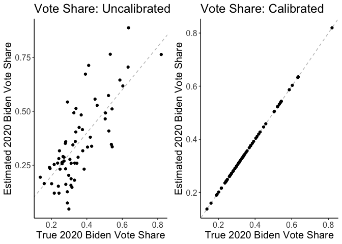
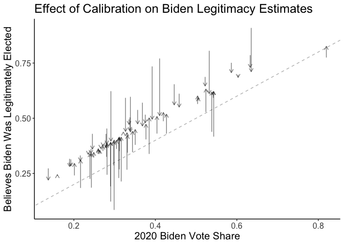

calibratedMRP: An `R` package for improved small-area estimation with
MRP
================

``` r
library(calibratedMRP)
library(brms)
#> Loading required package: Rcpp
#> Loading 'brms' package (version 2.22.0). Useful instructions
#> can be found by typing help('brms'). A more detailed introduction
#> to the package is available through vignette('brms_overview').
#> 
#> Attaching package: 'brms'
#> The following object is masked from 'package:stats':
#> 
#>     ar
library(dplyr)
#> 
#> Attaching package: 'dplyr'
#> The following objects are masked from 'package:stats':
#> 
#>     filter, lag
#> The following objects are masked from 'package:base':
#> 
#>     intersect, setdiff, setequal, union
library(ggplot2)
load("vignette-data.rdata")
ls()
#> [1] "mod"     "ps_cty"  "surv"    "targets"
```

We will use data from an opt-in survey conducted in 2022 to estimate the
share of people who believe that Joe Biden was legitimately elected in
2020. The survey asked three questions that we will include in analysis:

- `biden_legitimate`: Binary variable indicating belief that Joe Biden
  is the legitimate president.
- `biden_appr`: Binary variable indicating approval of Joe Biden’s job
  performance.
- `presvote2020_twoparty`: Two-party vote choice in the 2020
  presidential election, coded as a binary variable for Biden (1)
  vs. Trump (0).

## Step 1: Estimate outcome model using `brms`

First, we specify a multivariate outcome model using the `brms` package.
Here, we model binary outcomes as a function of demographic variables,
geographic variables, and random effects for geography. We make use of
two features of the `brms` modeling syntax. First, the `mvbind()`
function specifies a multivariate response vector. Second, the random
effects syntax `(1 | name | grouping_variable)` specifies random
intercepts for each level of `grouping_variable`, and these intercepts
are allowed to be correlated across outcomes. This step is extremely
important, as the estimated covariance matrix is used in downstream
calibration — allowing us to adjust estimates for outcomes where there
is no ground-truth data.

``` r
# Define formula
formula <- bf(
  mvbind(biden_legitimate, biden_appr, presvote2020_twoparty) ~

    # individual-level predictors
    gender + as.integer(agegrp) + (1 | age | agegrp) + race + educ +

    # state-level predictors
    st_demvs_2016_z + (1 | censreg | census.region) + (1 | state | state) +

    # county-level predictors
    cty_pct_nonwhite_z +  cty_pct_hispanic_z +
    cty_pct_college_z + cty_med_inc_z + cty_dem2020_z +
    (1 | c | countyfips)
)

# Estimate model
priors <- prior(normal(0, 5), class = b)
mod <- brm(formula = formula,
           data = surv,
           family = bernoulli,
           prior = priors,
           chains = 4, 
           cores = 4,
           iter = 1000,
           backend = "cmdstanr",
           adapt_delta = .995,
           max_treedepth = 12)
```

## Step 2: Calibrate MRP estimates

Next, the `calibrate_mrp()` function generates estimates of outcomes,
ensuring that the estimates match known population-level margins stored
in `targets`. Outcomes with known margins will be calibrated to match
exactly. Other outcomes will be adjusted according to their correlation
with the outcomes with gorund-truth data. Here, we will calibrate to
known county-level margins for `presvote2020_twoparty`, and estimates
for `biden_legitimate` and `biden_appr` will be adjusted accordingly.
For illustration, we’ll just include data from Pennsylvania and only
perform the calibration for a subset of the posterior draws.

``` r
calib_res <- calibrate_mrp(model = mod, 
                           ps_table = ps_cty %>% filter(state == "PA"), 
                           weight = "est_n", 
                           targets = targets, 
                           geography = "countyfips", 
                           method = "bayes",
                           draw_ids = sample(1:brms::ndraws(mod), 200))
#> Loading required package: rstan
#> Warning: package 'rstan' was built under R version 4.4.3
#> Loading required package: StanHeaders
#> Warning: package 'StanHeaders' was built under R version 4.4.3
#> 
#> rstan version 2.36.0.9000 (Stan version 2.36.0)
#> For execution on a local, multicore CPU with excess RAM we recommend calling
#> options(mc.cores = parallel::detectCores()).
#> To avoid recompilation of unchanged Stan programs, we recommend calling
#> rstan_options(auto_write = TRUE)
#> For within-chain threading using `reduce_sum()` or `map_rect()` Stan functions,
#> change `threads_per_chain` option:
#> rstan_options(threads_per_chain = 1)
#> No `outcomes` provided, defaulting to outcome variables from the model formula: 
#> • bidenlegitimate, bidenappr, presvote2020twoparty
#> Using the following variables for calibration: 
#> • presvote2020twoparty
#> Generating estimates for the following outcomes: 
#> • bidenlegitimate, bidenappr, presvote2020twoparty
```

## Step 3: Poststratify

Finally, we can poststratify to whatever level is of interest, using the
`poststratify()` function. Here we’ll poststratify to the county level.
Because we are working in a Bayesian framework, we will poststratify
once for each draw from the posterior, using `purrr::map()`, then
average these results together to obtain our posterior mean estimates.

``` r
out_draws <- calib_res$results %>% 
  group_split(.draw) %>% 
  purrr::map(~ poststratify(.x, outcomes = c(starts_with("biden"), starts_with("presvote")),
                            weight = est_n, by = countyfips)) %>% 
  bind_rows(.id = ".draw") 

out <- out_draws %>% 
  summarise(across(c(starts_with("biden"), starts_with("presvote")),
                   list(mean = mean,
                        q5 = ~ quantile(.x, .05),
                        q95 = ~ quantile(.x, .95))),
            .by = countyfips)
head(out, 20)
#> # A tibble: 20 × 19
#>    countyfips bidenlegitimate_mean bidenlegitimate_q5 bidenlegitimate_q95
#>    <chr>                     <dbl>              <dbl>               <dbl>
#>  1 42001                     0.575             0.407                0.754
#>  2 42003                     0.695             0.642                0.744
#>  3 42005                     0.361             0.0972               0.752
#>  4 42007                     0.768             0.643                0.880
#>  5 42009                     0.250             0.0834               0.452
#>  6 42011                     0.602             0.520                0.693
#>  7 42013                     0.314             0.185                0.487
#>  8 42015                     0.392             0.187                0.587
#>  9 42017                     0.694             0.608                0.773
#> 10 42019                     0.503             0.399                0.598
#> 11 42021                     0.256             0.112                0.434
#> 12 42023                     0.335             0.0930               0.708
#> 13 42025                     0.507             0.352                0.657
#> 14 42027                     0.520             0.413                0.630
#> 15 42029                     0.748             0.699                0.795
#> 16 42031                     0.187             0.0602               0.334
#> 17 42033                     0.328             0.163                0.531
#> 18 42035                     0.222             0.0595               0.399
#> 19 42037                     0.353             0.171                0.553
#> 20 42039                     0.363             0.163                0.598
#> # ℹ 15 more variables: bidenappr_mean <dbl>, bidenappr_q5 <dbl>,
#> #   bidenappr_q95 <dbl>, bidenlegitimate_calib_mean <dbl>,
#> #   bidenlegitimate_calib_q5 <dbl>, bidenlegitimate_calib_q95 <dbl>,
#> #   bidenappr_calib_mean <dbl>, bidenappr_calib_q5 <dbl>,
#> #   bidenappr_calib_q95 <dbl>, presvote2020twoparty_mean <dbl>,
#> #   presvote2020twoparty_q5 <dbl>, presvote2020twoparty_q95 <dbl>,
#> #   presvote2020twoparty_calib_mean <dbl>, …
```

## Step 4: Visualize results

Because we calibrated to known county-level margins for
`presvote2020_twoparty`, the estimates for this outcome will match the
ground-truth data exactly. Estimates for `biden_legitimate` and
`biden_appr` will be adjusted according to their correlation with
`presvote2020_twoparty`. Here we show the effect of the calibration
procedure, relative to uncalibrated MRP.




A final way to visualize the effect of calibration is to plot the change
in the estimates as a function of error in the vote share estimates.
When there is no error in the vote share estimate, the calibrated and
uncalibrated estimates are the same. When there is positive error (i.e.,
overestimating Biden vote share), then the calibrated estimate of
`biden_legitimate` is lower than the uncalibrated estimate.

    #> `geom_smooth()` using formula = 'y ~ x'


